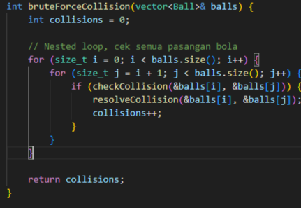
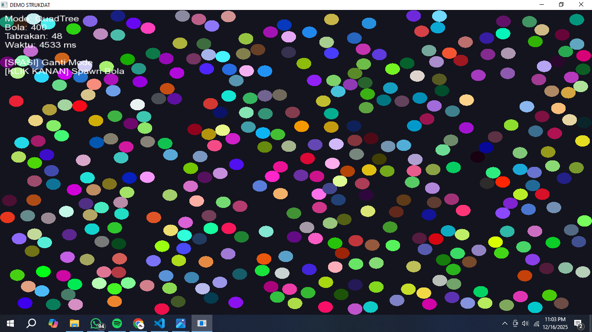

# FP STRUKTUR DATA

## DESKRIPSI
Program ini merupakan simulasi collision detection bola 2D menggunakan bahasa C++ dan library SFML.  
Tujuan utama program adalah membandingkan kinerja algoritma **Brute Force** dan **QuadTree** dalam mendeteksi tabrakan antar objek.

Simulasi berjalan secara real-time dan menampilkan jumlah tabrakan serta waktu eksekusi dari algoritma yang digunakan.

---

## ALGORITMA YANG DIGUNAKAN
### 1. Brute Force Collision Detection
Algoritma Brute Force bekerja dengan cara membandingkan setiap pasangan bola satu per satu.

Langkah kerja:
- Mengambil satu bola
- Membandingkannya dengan semua bola lainnya
- Menghitung jarak antar pusat bola
- Jika jarak lebih kecil dari jumlah radius, maka terjadi tabrakan

Rumus jarak antar dua bola:
d = sqrt((x2 - x1)^2 + (y2 - y1)^2)

Jika:
d < r1 + r2  
maka terjadi tabrakan.

Kompleksitas waktu:
- O(n²)
- Kurang efisien untuk jumlah objek yang besar

---

### 2. QuadTree Collision Detection
QuadTree adalah struktur data yang membagi ruang dua dimensi menjadi empat bagian secara rekursif.  
Dengan QuadTree, pengecekan tabrakan hanya dilakukan pada objek-objek yang berada di area yang berdekatan.

Langkah kerja:
- Seluruh bola dimasukkan ke dalam QuadTree
- Untuk setiap bola dibuat area pencarian di sekitarnya
- QuadTree melakukan query untuk mendapatkan bola terdekat
- Collision detection dilakukan hanya pada bola hasil query

Kompleksitas waktu:
- O(n log n) (rata-rata)
- Lebih efisien dibandingkan Brute Force

---

## FITUR PROGRAM

### FITUR UTAMA
- Simulasi bola 2D secara real-time
- Deteksi tabrakan antar bola
- Pantulan bola terhadap batas window
- Perbandingan dua metode collision detection

### INFORMASI YANG DITAMPILKAN
- Mode algoritma yang digunakan
- Jumlah bola dalam simulasi
- Jumlah tabrakan yang terdeteksi
- Waktu eksekusi algoritma

### KONTROL PROGRAM
| Input | Fungsi |
|------|-------|
| Spasi | Mengganti mode Brute Force / QuadTree |
| Klik kanan mouse | Menambahkan bola baru |
| Tutup window | Mengakhiri program |

---

## TUJUAN PEMBELAJARAN
- Memahami konsep collision detection
- Membandingkan kompleksitas algoritma O(n²) dan O(n log n)
- Menerapkan struktur data QuadTree pada simulasi grafis
- Mengamati pengaruh optimasi algoritma terhadap performa program

---
## OUTPUT DARI CODE
### SCREEN CAPTURE
1. Brute Force 

2. QuadTree 

### SCREEN RECORD
